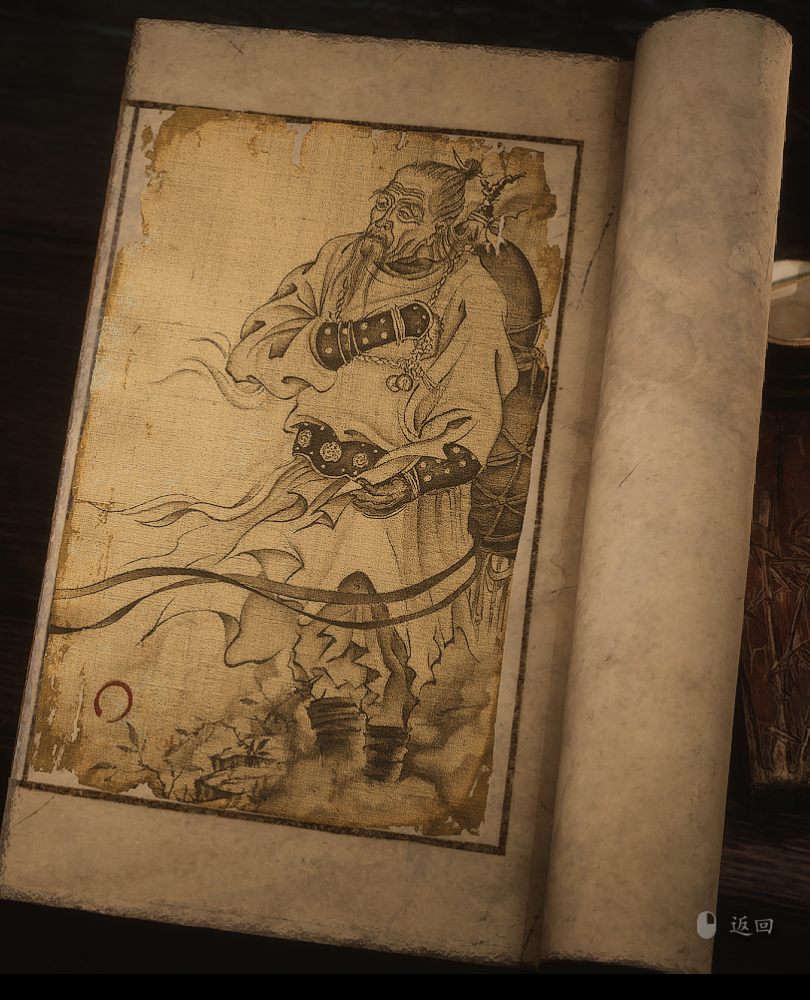

4.32 袁守诚

> 该人物没有诗，不过故事是用一段诗描述的

半世虚度半世忙，一朝彻悟一朝忘。

袖课岂知天下计，卦辞怎阻痴心郎。

风波重重世情险，红尘滚滚人欲狂。

聚散离合如朝露，恩怨情仇似电光。

千秋兴废无新意，百年成败有非常。

收因结果循天命，缘起缘落没斜阳。

造作恶语逆其耳，轻慢妄言挑其肠。

潦草拙笔污其眼，有心勾描剖其伤。

妖魔鬼怪皆是我，神仙菩萨一般样。

泪若涌泉莫相问，仰天大笑是荒唐。

