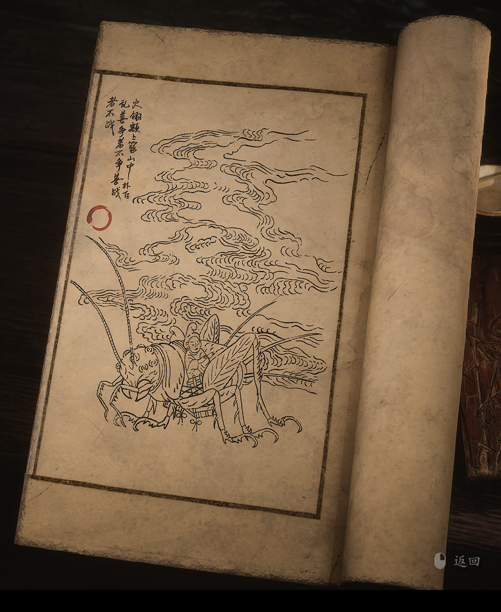

2.54 凤翅将军

> 火翎额上簪，山中扑飞乱。
>
> 善争者不争，善战者不战。

灵明石猴，天性聪慧，登界游方之中，学人礼，学人话，又在灵台方寸山通了法性。今次不表命里的天赋，单说他后来悟彻的经历。

他在鹰愁涧负气出走，老龙王与他讲了一番道理，便又回去认错，从不专断独行，听得进善言。

他与妖怪称兄道弟，与神仙们逗趣嬉闹，与菩萨调嘴玩笑，谁都喜欢他，谁都肯帮他。知情识理，懂得进退分寸。

他遇火呼风，唤雨请龙，打探变小妖，受困借法宝。遇到难解的局面，请高人，搬救兵，外力无所不用，鲜少强攻，从不硬扛。

这凤翅将军，头生多目，知己知彼，一路跳脱不停，强敌能避则避，倒有那猴子的几分乖觉。不愧是戴在猴头上的冠子，最懂他那些活络心思。

