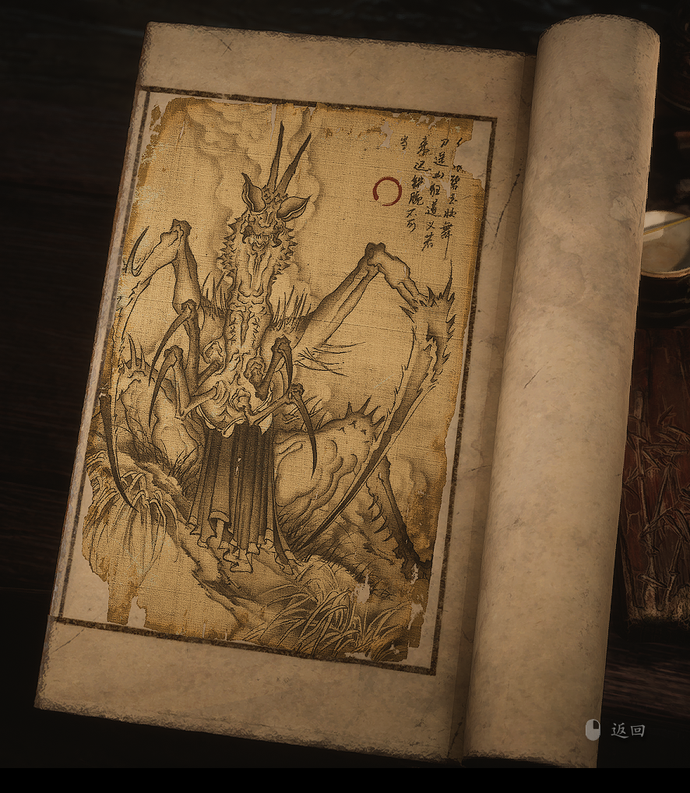

2.55 碧臂螂

> 红眼碧玉妆，舞刀逞凶狂。
>
> 道义若来迟，铁腕不可当。

唐僧多劝善，悟空多惩恶。

在奎木狼处，他听闻了百花羞所受的苦楚，又见她为了情分和孩子留恋不舍，索性让八戒将那两个妖儿从天上掼下去，摔成了两个肉坨子。

在杨老汉家，他听闻了老夫妻不肖儿子的行径，又见他们为了香火纵容他为非作歹，哪怕杨老汉事先求情，他也索性将那儿子的头割了下来。

凶匪恶徒，他天性不肯姑息；鬼魅妖邪，他乐得斩草除根。西行路上的累累血债，虽各有缘故，却多半都要算在猴子头上。

世人皆知另外三件披挂，却不知这螳螂是大圣的手甲化生。想来这手甲，必是传承了大圣不为人知的狠辣手段，就连捉弄八戒这件事，也是如出一辙哩。

