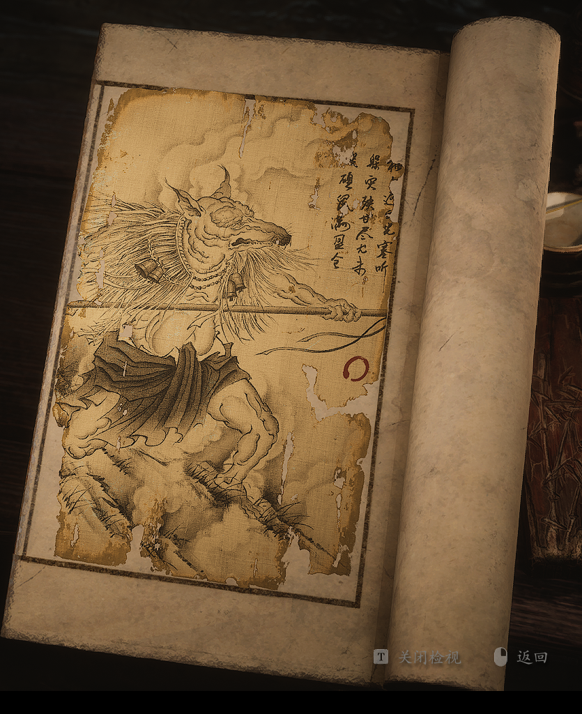

1.17 鼠司空

> 袖占避血光，塞听躲灾殃。
>
> 甘尽尤未晓，硕鼠满盈仓。

斯哈哩国更名元年，国王颁布“敬鼠令”，举国上下，以“鼠”为天佑之物，不可扑杀，违者监押，国王亲审。此令一出，方圆百里的鼠妖，俱往流沙国迁徙。其时，百姓与群妖混住，多有不谐之事，但惧怕国王法令，只得暗自忍耐。是时，翰林院学士们发起联名上书，谏言国王修改法令，将鼠妖迁居城西南角安置，让百姓能够得享太平。

翰林院有一老学究，深谙占卜之道，在百臣联名上书之日，就前程袖占一课，卦象极凶，便悄声告知自己两名年轻的下属，今日非黄道吉日，不宜上书，让他们随自己一同告病回家。 年轻子弟不以为意，正是热血沸腾之时，慷慨而去。

待老学究刚刚步出皇庭，就见御林军围了大殿，里头喊声无数，料是一片血雨腥风。老学究只是颤悠悠地捂住双耳，缓缓朝家而去。其后三天，王不早朝，群官调职，他抬封司空，位及一品，风光无两。又过了几年，日他面观铜镜，只见鼻子变得又长又尖，其旁生着粗而韧的须子。后来他连镜子也不照了，但他明白，自己和剩下的人一样，都顶着一张老鼠的脸庞。

